<!--
  Generated by .github/profile/build_all.py — edit .github/profile/config.py or the
  files in .github/profile/sections/ and push; the rebuild workflow regenerates everything.
-->


&nbsp;&nbsp;&nbsp;&nbsp;&nbsp;&nbsp;

 

**I'm Paarth, and I build AI products end to end.** LLM features with retrieval and agents underneath, and the Next.js + Node apps that put them in front of real users. By day I'm a full-stack intern at [Language Metrics](https://languagemetrics.in), shipping to a live SaaS. I'm a third-year CSE student at KIET (CGPA 8.57), a Quackathon 2026 track winner, and certified in agentic AI by Oracle.

**AI** — LLMs, RAG (Qdrant, ChromaDB, sqlite-vec), agentic AI (LangGraph, LangChain), local models (Ollama), evals (RAGAS) 
**Full-stack** — Next.js, React, TypeScript, Node.js, Express, FastAPI, PostgreSQL + Prisma, JWT / RBAC, payments 
**Shipping now** — the Teacher & Admin portals behind [languagemetrics.in](https://languagemetrics.in) 
**Looking for** — AI engineering and full-stack internships. [Email me](mailto:i.m.paarthgupta@gmail.com).

 

<picture><source media="(prefers-color-scheme: dark)" srcset="assets/h-layers.svg"></picture>


 

<picture><source media="(prefers-color-scheme: dark)" srcset="assets/h-card.svg">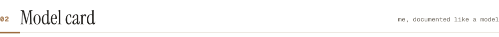</picture>


 

<picture><source media="(prefers-color-scheme: dark)" srcset="assets/h-skills.svg">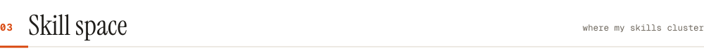</picture>


 

<picture><source media="(prefers-color-scheme: dark)" srcset="assets/h-prod.svg"></picture>

<a href="https://languagemetrics.in"></a>

 

<picture><source media="(prefers-color-scheme: dark)" srcset="assets/h-evidence.svg">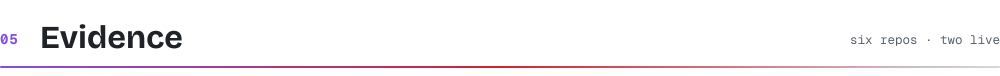</picture>

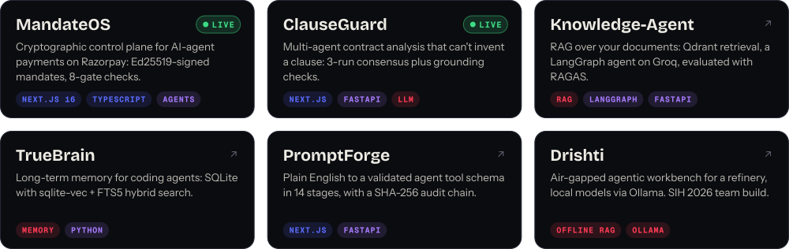

<b><a href="https://github.com/paarth293/MandateOS">MandateOS</a></b> (<a href="https://mandate-os-lovat.vercel.app">live</a>) · <b><a href="https://github.com/paarth293/ClauseGuard">ClauseGuard</a></b> (<a href="https://clause-guard-ruby.vercel.app">live</a>) · <a href="https://github.com/paarth293/Knowledge-Agent">Knowledge-Agent</a> · <a href="https://github.com/paarth293/TrueBrain">TrueBrain</a> · <a href="https://github.com/paarth293/PromptForge">PromptForge</a> · <a href="https://github.com/TechTonicWavee/Drishti">Drishti</a>

 

<picture><source media="(prefers-color-scheme: dark)" srcset="assets/h-activity.svg"></picture>


 

<picture><source media="(prefers-color-scheme: dark)" srcset="assets/h-contact.svg"></picture>

<a href="mailto:i.m.paarthgupta@gmail.com"></a>

Every image here is generated from source in <a href=".github/profile">.github/profile</a>: real fonts turned into outlines, pure-CSS animation, an activity city that syncs daily, and no third-party widgets.

