<!--
  ╔══════════════════════════════════════════════════════════════════╗
  ║   paarth293 — GitHub Profile README                             ║
  ║   Paarth Gupta · Full-Stack · AI Agents · 3D Web                ║
  ╚══════════════════════════════════════════════════════════════════╝
-->

<div align="center">



</div>

---

<div align="center">

[](https://www.linkedin.com/in/paarth-gupta-279aab328/)&nbsp;
[](https://leetcode.com/u/Paarth_05/)&nbsp;
[](mailto:i.m.paarthgupta@gmail.com)&nbsp;
[](https://languagemetrics.in)&nbsp;
[](https://clause-guard-ruby.vercel.app)

</div>

---

## `$ cat about.sh`

```bash
#!/usr/bin/env bash
# ─────────────────────────────────────────────────────────
#  WHO AM I
# ─────────────────────────────────────────────────────────

NAME="Paarth Gupta"
ROLE="Full-Stack Dev  ·  AI Systems Builder  ·  3D Web Explorer"
DEGREE="B.Tech CSE @ KIET Ghaziabad (2024–28)  |  CGPA 8.57"

CURRENTLY_BUILDING="Language Metrics — teacher & admin portals"
                  # React · Node.js · PostgreSQL · Prisma · Razorpay

AFTER_HOURS=(
  "Agentic AI systems that build their own tools"
  "Offline / air-gapped LLM pipelines"
  "Long-term memory engines for coding agents"
)

ACHIEVEMENTS=(
  "🏆  Quackathon 2026 — Track Winner, team lead"
  "🇮🇳  Smart India Hackathon 2026 — Drishti (air-gapped AI refinery)"
  "💚  LeetCode 1400+ | DSA in Java"
)

OPEN_TO="SDE internships · Full-Stack internships · AI/ML roles"
REPLY_TIME="< 24 h  |  IST (UTC+5:30)"
```

---

## `$ docker ps --active-systems`

<div align="center">



</div>

> Click any repo name below to open it.

---

## `$ ls -la projects/`

<table>
<tr>
<td width="50%" valign="top">

### 🤖 [MandateOS](https://github.com/paarth293/MandateOS)
```
type    : AI · Agentic OS Layer
lang    : Python
status  : ● RUNNING
```
Turns high-level mandates into structured execution plans. Autonomous task decomposition with tool orchestration — no human in the loop once deployed.

**`→`** [github.com/paarth293/MandateOS](https://github.com/paarth293/MandateOS)

</td>
<td width="50%" valign="top">

### ⚖️ [ClauseGuard](https://github.com/paarth293/ClauseGuard) `LIVE`
```
type    : Legal AI · Full-Stack
lang    : Python · FastAPI
status  : ● LIVE  →  vercel.app
```
AI contract analyser — detects risky clauses, suggests rewrites, explains legalese in plain English. Deployed and accessible.

**`→`** [clause-guard-ruby.vercel.app](https://clause-guard-ruby.vercel.app)

</td>
</tr>
<tr>
<td width="50%" valign="top">

### 🧠 [TrueBrain](https://github.com/paarth293/TrueBrain)
```
type    : Memory Engine · AI
lang    : Python
status  : ● RUNNING
```
Local-first long-term memory for coding agents. Resolves stale context, stores verified facts, surfaces the right memory at inference time.

**`→`** [github.com/paarth293/TrueBrain](https://github.com/paarth293/TrueBrain)

</td>
<td width="50%" valign="top">

### 🔍 [Knowledge-Agent](https://github.com/paarth293/Knowledge-Agent)
```
type    : RAG · Local LLM
lang    : Python
status  : ● RUNNING
```
Ingest docs → build semantic index → answer queries. Zero data leaves your machine. Built for air-gapped and privacy-first deployments.

**`→`** [github.com/paarth293/Knowledge-Agent](https://github.com/paarth293/Knowledge-Agent)

</td>
</tr>
<tr>
<td width="50%" valign="top">

### ⚙️ [PromptForge](https://github.com/paarth293/PromptForge)
```
type    : Dev Tool · Pipeline
lang    : Python  (MIT)
status  : ◑ BUILDING
```
Plain English → validated agent tool schema. 14-stage pipeline with SHA-256 audit chain. Turns loose specs into production-ready tool definitions.

**`→`** [github.com/paarth293/PromptForge](https://github.com/paarth293/PromptForge)

</td>
<td width="50%" valign="top">

### 🏭 [Drishti](https://github.com/TechTonicWavee/Drishti) `SIH 2026`
```
type    : Air-gapped AI · Hackathon
lang    : React · FastAPI
status  : ● DEPLOYED
```
Agentic AI workbench for a refinery — zero outbound calls, all inference runs locally inside the network perimeter. Built for Smart India Hackathon.

**`→`** [github.com/TechTonicWavee/Drishti](https://github.com/TechTonicWavee/Drishti)

</td>
</tr>
</table>

---

## `$ cat neural_pathways.cfg`

<div align="center">



</div>

---

## `$ system --specs`

<div align="center">

| Module | Technologies |
|:---|:---|
| **Languages** |     |
| **Frontend** |    |
| **Backend** |    |
| **Data** |    |
| **AI / ML** |    |
| **DevOps** |    |

</div>

---

## `$ git log --oneline --journey`

```
Sep 2026  feat: shipped MandateOS, ClauseGuard, TrueBrain, Knowledge-Agent, PromptForge
Aug 2026  feat: first production code at Language Metrics — real users, real money
Jun 2026  🏆  win: Quackathon 2026 — track winner, team lead
Jun 2026  feat: built Drishti for Smart India Hackathon (offline agentic AI)
2025      feat: shipped VeriVolunte — first full-stack product end to end
2024      init: B.Tech CSE @ KIET Ghaziabad — CGPA 8.57
────────────────────────────────────────────────────────────
NEXT      open: SDE / Full-Stack internship → i.m.paarthgupta@gmail.com
```

---

## `$ github --metrics`

<div align="center">


&nbsp;


</div>

<div align="center">


</div>

---

## `$ ping contact`

<div align="center">

```
PING i.m.paarthgupta@gmail.com
PING linkedin.com/in/paarth-gupta-279aab328
PING leetcode.com/u/Paarth_05

avg response time: < 24 h  |  timezone: IST (UTC+5:30)
```

[](mailto:i.m.paarthgupta@gmail.com)
[](https://www.linkedin.com/in/paarth-gupta-279aab328/)

</div>

---

<div align="center">

```
╔════════════════════════════════════════════════════════════╗
║   paarth293@architect:~$ _                                 ║
║                                                            ║
║   Open to SDE · Full-Stack · AI internships                ║
║   Building things that think, render, and scale            ║
╚════════════════════════════════════════════════════════════╝
```

*Profile auto-updates daily via GitHub Actions*

</div>
