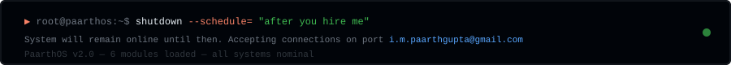

<!--
  ╔══════════════════════════════════════════════════════════╗
  ║  PaarthOS v2.0 — GitHub Profile                         ║
  ║  Every section is a terminal command.                    ║
  ║  Every visual is a custom animated SVG.                  ║
  ║  No third-party widgets. No badge soup.                  ║
  ╚══════════════════════════════════════════════════════════╝
-->

<div align="center">



</div>

<br/>

<div align="center">

[](https://www.linkedin.com/in/paarth-gupta-279aab328/)&nbsp;&nbsp;
[](https://leetcode.com/u/Paarth_05/)&nbsp;&nbsp;
[](mailto:i.m.paarthgupta@gmail.com)&nbsp;&nbsp;
[](https://clause-guard-ruby.vercel.app)&nbsp;&nbsp;
[](https://languagemetrics.in)

</div>

---

## `▸ netstat --topology`

> How my projects connect. Each node is a real system. Lines show shared infrastructure.

<div align="center">



</div>

<table>
<tr><td align="center" width="16%">

**[MandateOS](https://github.com/paarth293/MandateOS)**

`AI · Agents`

Agentic OS layer — turns mandates into execution plans

</td><td align="center" width="16%">

**[ClauseGuard](https://github.com/paarth293/ClauseGuard)**

`Legal AI` [](https://clause-guard-ruby.vercel.app)

Contract clause analysis and rewriting

</td><td align="center" width="16%">

**[TrueBrain](https://github.com/paarth293/TrueBrain)**

`Memory · AI`

Long-term memory engine for coding agents

</td><td align="center" width="16%">

**[Knowledge-Agent](https://github.com/paarth293/Knowledge-Agent)**

`RAG · Local`

Air-gapped semantic search over your docs

</td><td align="center" width="16%">

**[PromptForge](https://github.com/paarth293/PromptForge)**

`Pipeline · MIT`

14-stage tool schema generator with SHA-256 chain

</td><td align="center" width="16%">

**[Drishti](https://github.com/TechTonicWavee/Drishti)**

`SIH 2026`

Air-gapped AI for refinery operations

</td></tr>
</table>

---

## `▸ lspci --board-layout`

> Tech stack rendered as a circuit board. Each chip is a technology I ship with.

<div align="center">



</div>

<details>
<summary><code>▸ cat /proc/modules --verbose</code></summary>
<br/>

| Bus | Module | Version | Notes |
|:---|:---|:---|:---|
| **BUS:0** | Python | 3.x | Primary language for all AI systems |
| **BUS:0** | JavaScript / TypeScript | ES6+ | Frontend + Node.js backends |
| **BUS:0** | React | 18.x | UI framework for production apps |
| **BUS:0** | Next.js | 14 | SSR/SSG for Language Metrics, portfolio |
| **BUS:0** | Java | — | DSA · LeetCode 1400+ |
| **BUS:1** | Node.js | 20 | API servers · Express · middleware |
| **BUS:1** | FastAPI | — | Python APIs for AI microservices |
| **BUS:1** | PostgreSQL | — | Primary datastore · Prisma ORM |
| **BUS:1** | LangChain | — | Agent orchestration · RAG pipelines |
| **BUS:1** | Three.js | — | 3D web · portfolio city renderer |

</details>

---

## `▸ git log --graph --journey`

<div align="center">



</div>

---

## `▸ htop --metrics`

<div align="center">


&nbsp;


</div>

<br/>

<div align="center">


</div>

---

## `▸ man paarth`

```
NAME
    paarth — full-stack developer, AI systems builder

SYNOPSIS
    paarth [--build SYSTEM] [--deploy TARGET] [--research DOMAIN]

DESCRIPTION
    Second-year B.Tech CSE student at KIET Ghaziabad (CGPA 8.57).
    Builds agentic AI systems, full-stack production apps, and 3D
    web experiences. Currently shipping code at Language Metrics
    (production SaaS with real users and real revenue).

    Quackathon 2026 track winner. Smart India Hackathon builder.
    LeetCode 1400+ in Java. Six public repositories, two deployed
    to production, all under active development.

OPTIONS
    --hire     Open to SDE / full-stack / AI internships.
    --contact  i.m.paarthgupta@gmail.com | LinkedIn
    --timezone IST (UTC+5:30). Replies within a day.
    --stack    Python, JS/TS, React, Next.js, Node, FastAPI,
               PostgreSQL, Prisma, LangChain, Three.js

SEE ALSO
    MandateOS(1), ClauseGuard(1), TrueBrain(1),
    Knowledge-Agent(1), PromptForge(1), Drishti(1)

BUGS
    Sleeps too little. Builds too much.
```

---

<div align="center">



</div>

<div align="center">

<sub>Every SVG on this page is hand-coded and animated. No Canva, no templates, no Figma exports.</sub>

</div>
